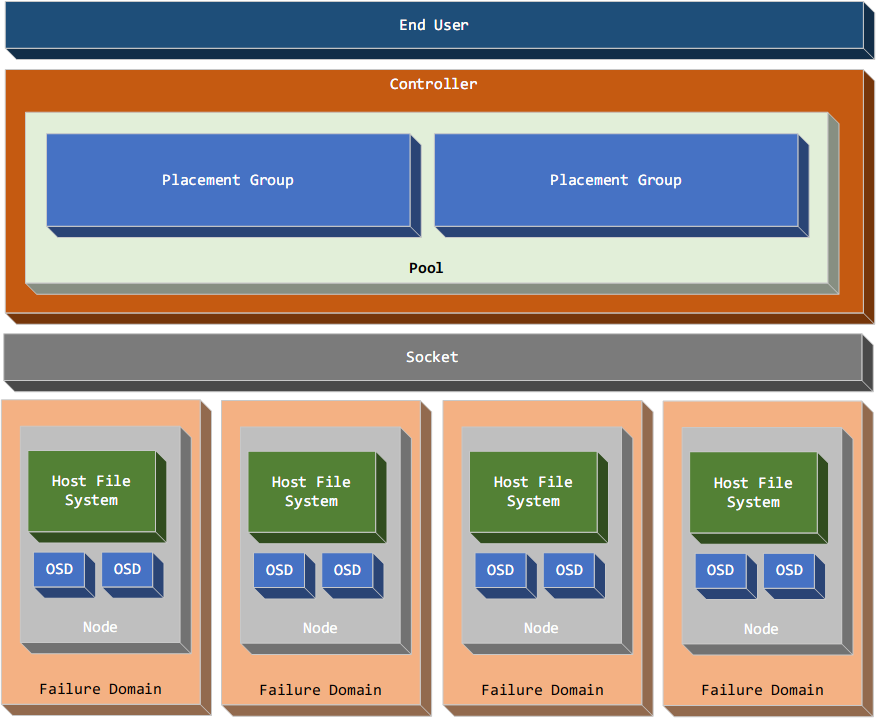
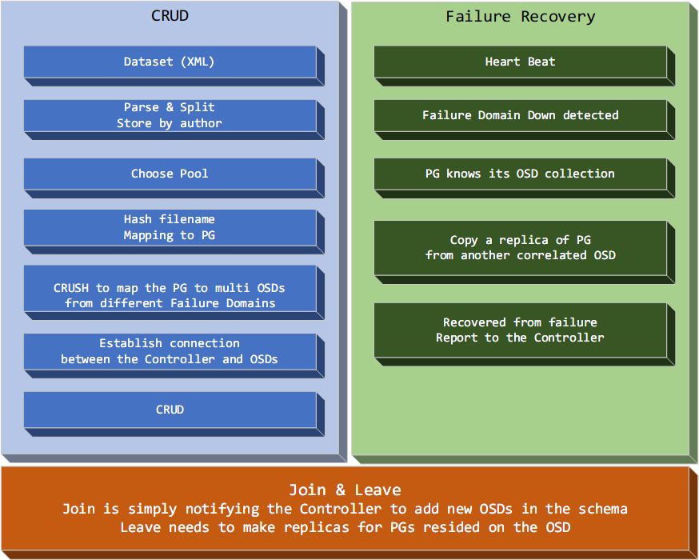

# Distributed System Homework 2

## Dataset

[DBLP](http://dblp.uni-trier.de/xml/)

## Design

I borrowed some good ideas from Ceph's CRUSH algorithm, read the [paper](./paper/crush.pdf)

Architecture

and common routines

TODO: Finish the DOC
